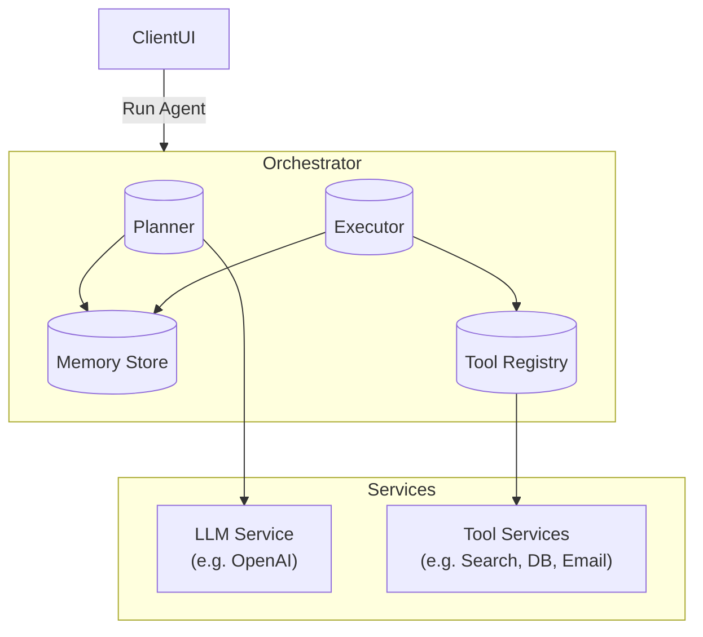
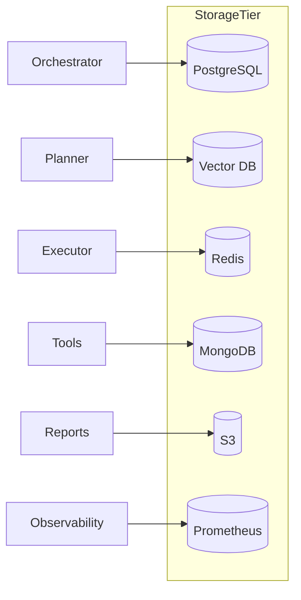
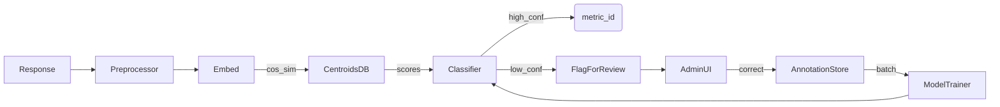
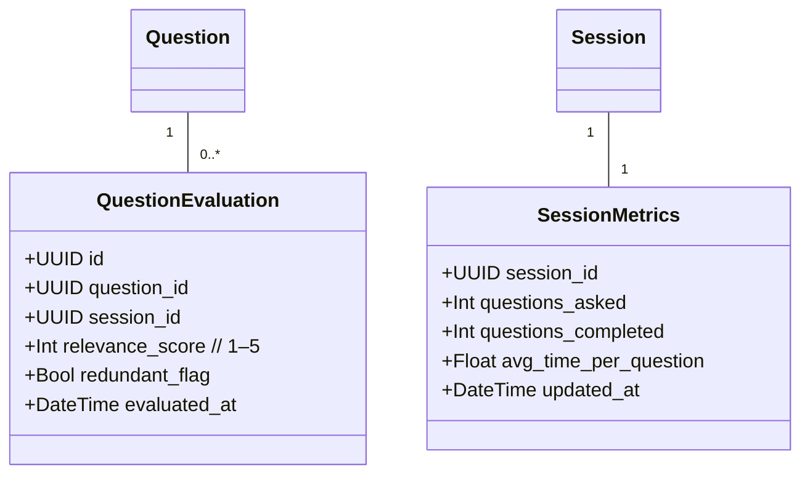
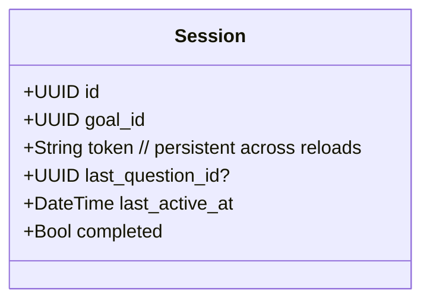

# PRD: Goal‑Oriented Adaptive Questionnaire MVP

**Date:** 2025‑04‑20  
**Authors:** Hardik Srivastava  
**Tech Stack:**  
- **Backend:** Python 3.11, FastAPI  
- **Frontend:** React (TypeScript), Tailwind CSS, **ShadcnUI**
- **Database:** PostgreSQL (primary), Redis (caching/session)  
- **LLM & AI Orchestration:** OpenAI API (via `openai` Python SDK)  
- **Hosting:** Vercel (frontend), AWS/GCP (FastAPI + DB)

---

## 1. Vision & Objectives

**Vision:**  
Enable small businesses to define high‑level goals (e.g. “measure consumer sentiment for Dish X”) and automatically generate, serve, and analyze adaptive surveys that drill down on exactly the metrics they care about—without writing any questions manually.

**MVP Objectives:**  
1. Let a business admin create a “Goal” and review/edit AI‑generated metrics.  
2. Launch a shareable, consumer‑facing questionnaire that dynamically adapts questions based on user answers.  
3. Persist answers, map them to metrics, and compute simple summary scores.  
4. Provide a basic analytics dashboard for the admin.

---

## 2. Key Features & User Stories

### 2.1 Business Admin (“Manager”) Portal

| #  | User Story                                                                                                                                 | Acceptance Criteria                                                                                                                                               |
|----|---------------------------------------------------------------------------------------------------------------------------------------------|--------------------------------------------------------------------------------------------------------------------------------------------------------------------|
| A1 | **As a** business admin<br>**I want to** log in securely<br>**So that** I can manage my goals and questionnaires                                 | - Auth via email/password (JWT).<br>- Redirect to dashboard on success.<br>- Error messages on failure.                                                            |
| A2 | **As a** business admin<br>**I want to** create a new Goal by entering a plain‑text description (“Measure consumer sentiment for Dish X”)     | - Form with “Goal Description” field.<br>- On submit, backend calls `POST /api/goals/`.<br>- See loading indicator until metrics arrive.                            |
| A3 | **As a** business admin<br>**I want to** review & edit AI‑generated metrics (list of 5–8 items)                                               | - Display metrics list with inline editing (name, type, weight).<br>- “Add/Remove Metric” buttons.<br>- “Save Metrics” triggers `PUT /api/goals/{id}/metrics/`.     |
| A4 | **As a** business admin<br>**I want to** publish the questionnaire once metrics are finalized                                                 | - “Publish” button calls `POST /api/goals/{id}/publish/`.<br>- Backend generates initial question(s) via LLM.<br>- Published state locked metrics.                 |
| A5 | **As a** business admin<br>**I want to** view real‑time analytics summary (average scores per metric)                                         | - Dashboard charts for each metric.<br>- Show number of responses, average numeric score, sentiment summary for text metrics.<br>- Refresh on demand.             |

### 2.2 Consumer (“Respondent”) Interface

| #  | User Story                                                                                                                                 | Acceptance Criteria                                                                                                                                               |
|----|---------------------------------------------------------------------------------------------------------------------------------------------|--------------------------------------------------------------------------------------------------------------------------------------------------------------------|
| B1 | **As a** respondent<br>**I want to** open a survey link without logging in<br>**So that** answering is frictionless                                | - Public URL pattern: `/survey/{session_token}`.<br>- Renders first question.                                                                                      |
| B2 | **As a** respondent<br>**I want to** answer one question at a time<br>**So that** I'm guided step‑by‑step                                      | - UI shows current question + input widget (scale, MCQ, text).<br>- "Next" disabled until valid answer entered.                                                   |
| B3 | **As a** respondent<br>**I want to** see follow‑up questions adapt based on my previous answers                                               | - On submitting answer, React calls `POST /api/sessions/{token}/responses/`.<br>- Backend returns next question via LLM.<br>- UI transitions smoothly (spinner).   |
| B4 | **As a** respondent<br>**I want to** complete the survey in ≤12 questions                                                                    | - Stop when all metrics covered or question count hits limit (12).<br>- Show "Thank you" screen with optional "Leave feedback" text.                                |

---

## 3. System Architecture
mermaid
flowchart LR
  AdminUI[React Admin UI] -->|REST| FastAPI
  SurveyUI[React Survey UI] -->|REST| FastAPI
  FastAPI --> Postgres[(PostgreSQL)]
  FastAPI --> Redis[(Redis Cache)]
  FastAPI -->|OpenAI SDK| OpenAI[(LLM Service)]
  FastAPI -->|JWT| AuthService[(Auth)]
---

## 4. Data Model
```
mermaid
classDiagram
    class Goal {
      +UUID id
      +UUID business_id
      +String description
      +Bool published
      +DateTime created_at
    }
    class Metric {
      +UUID id
      +UUID goal_id
      +String name
      +String type       // likert, multiple_choice, text
      +Float weight
    }
    class Question {
      +UUID id
      +UUID metric_id
      +String text
      +String type       // scale, mcq, text
      +String[] options  // for mcq
      +UUID parent_qid?
    }
    class Session {
      +UUID id
      +UUID goal_id
      +String token
      +JSON state        // metrics covered, Q&A history
      +DateTime started_at
    }
    class Response {
      +UUID id
      +UUID session_id
      +UUID question_id
      +Any answer
      +DateTime answered_at
    }

    Goal "1" -- "0..*" Metric
    Metric "1" -- "0..*" Question
    Session "1" -- "0..*" Response
```

## 5. API Endpoints

### 5.1 Authentication

| Method | Path               | Body                             | Response                   |
|--------|--------------------|----------------------------------|----------------------------|
| POST   | `/api/auth/login`  | `{ email, password }`            | `{ access_token }`         |
| POST   | `/api/auth/signup` | `{ name, email, password }`      | `{ access_token }`         |

### 5.2 Goals & Metrics

| Method | Path                           | Body                                                                                      | Response                          |
|--------|--------------------------------|-------------------------------------------------------------------------------------------|-----------------------------------|
| GET    | `/api/goals/`                  | —                                                                                         | List of goals                     |
| POST   | `/api/goals/`                  | `{ description: string }`                                                                 | `{ id, metrics: [] }`             |
| PUT    | `/api/goals/{goal_id}/metrics` | `{ metrics: [{ name, type, weight }] }`                                                  | Updated metrics                   |
| POST   | `/api/goals/{goal_id}/publish` | —                                                                                         | `{ initial_questions: [Question] }` |

### 5.3 Survey Sessions & Responses

| Method | Path                                             | Body                                                                                         | Response                                |
|--------|--------------------------------------------------|----------------------------------------------------------------------------------------------|-----------------------------------------|
| POST   | `/api/goals/{goal_id}/sessions`                  | —                                                                                            | `{ session_token, first_question }`     |
| POST   | `/api/sessions/{token}/responses`                | `{ question_id, answer }`                                                                    | `{ next_question | null }`              |
| GET    | `/api/sessions/{token}/state`                    | —                                                                                            | `{ answered_questions, metrics_status }`|

### 5.4 Analytics

| Method | Path                              | Query Params            | Response                                     |
|--------|-----------------------------------|-------------------------|----------------------------------------------|
| GET    | `/api/goals/{goal_id}/analytics`  | —                       | `{ metric_summaries: [{ name, avg_score, count }] }` |

---

## 6. AI Prompt Templates

### 6.1 Generate Metrics

System: "You are an expert survey‑designer AI."
User: "Business goal: {{description}}. List 5–8 customer‑experience metrics (noun phrases)."
### 6.2 Choose Next Question

System: "You are an adaptive survey engine."
User: "Metrics: {{metrics_list}}. Q&A so far: {{history}}. Suggest the next question (text, type, options) targeting the lowest‑covered metric."
---

## 7. Non‑Functional Requirements

- **Performance:** <1s latency for UI actions; AI calls can take up to 2s.  
- **Scalability:**  Concurrent sessions up to 1k; horizontally scale FastAPI + DB read replicas.  
- **Security:** HTTPS everywhere; JWT auth; CORS locked to front-end domain.  
- **Reliability:** 99.9% uptime; automated retries on OpenAI API failures.  
- **Observability:** Logging (FastAPI + Uvicorn), Sentry for error tracking, Prometheus + Grafana for metrics.

---

## 8. Roadmap & Milestones

| Sprint | Goals                                                     |
|--------|-----------------------------------------------------------|
| 1      | — Setup monorepo, CI/CD<br>— Auth + basic DB migrations    |
| 2      | — Admin: create goal + metrics review UI                  |
| 3      | — LLM integration: metrics generation + question draft    |
| 4      | — Consumer UI: session flow + dynamic Q&A loop            |
| 5      | — Analytics endpoint + basic dashboard charts             |
| 6      | — Polishing: error handling, UX tweaks, end‑to‑end tests   |

# Agentic AI Service structure

## 1. Core Architectural Layers



1. **Planner**  
   - Takes user intent → LLM "plan" prompt → returns a sequence of high‑level steps (e.g. "1. search web for X", "2. summarize results").  
   - Stores plan in **Memory**.

2. **Executor**  
   - Reads the plan → picks next step → routes to a specific **Tool** (e.g. Web Search, SQL, Email).  
   - Feeds tool response back into **Memory**.

3. **Memory Store**  
   - A vector database or document store (e.g. Pinecone, Weaviate) for:  
     - **Short‑term**: full chat/session history  
     - **Long‑term**: user profiles, persistent knowledge  

4. **Tool Registry**  
   - A discoverable catalog of "tools" (microservices) with names, input/output schemas, and auth.  
   - The Executor uses this to dynamically invoke the right API.

---

## 2. Service-Decomposition

| Component        | Responsibility                                                      | Tech Examples                     |
|------------------|----------------------------------------------------------------------|-----------------------------------|
| **API Gateway**  | Single ingress for agent requests, handles auth/rate limiting       | Kong, AWS API Gateway, FastAPI    |
| **Orchestrator** | Hosts Planner & Executor logic, keeps session state                 | Python/FastAPI microservice       |
| **LLM Adapter**  | Wraps OpenAI (or other LLMs) with retry, batching, caching          | `openai` SDK + custom wrapper     |
| **Memory Layer** | Vector & metadata store for embeddings, plus a relational DB for metadata | Pinecone + PostgreSQL            |
| **Tool Services**| Individual microservices exposing external/actionable APIs (search, DB query, email, calendar, etc.) | Node.js/Express, Python/FastAPI   |
| **Worker Queue** | Async task orchestration for long‑running steps                     | RabbitMQ, Kafka, Celery           |
| **Observability**| Logging, tracing, metrics                                            | Prometheus/Grafana, Jaeger, Sentry|

---

## 3. Agent Workflow

1. **Client Request**  
   ```http
   POST /api/agents/run
   {
     "agent_type": "research_assistant",
     "input": "Find me top-3 competitors of Acme Corp in Europe."
   }
   ```
2. **Planner Kick‑off**  
   - Fetch agent "prompt template" & tool definitions.  
   - Call LLM:  
     ```
     "You are an agent. Steps to answer: …?"
     ```
   - Parse LLM's JSON plan:  
     ```json
     [
       { "tool": "web_search", "query": "Acme Corp competitors Europe" },
       { "tool": "summarize",   "input_key": "web_results" },
       { "tool": "format_report" }
     ]
     ```
3. **Step Execution Loop**  
   ```python
   for step in plan:
       tool = ToolRegistry.lookup(step["tool"])
       result = tool.call(step)
       Memory.write(step, result)
   ```
4. **Result Aggregation**  
   - Once all steps done → collate Memory → final LLM call for polish/format.

---

## 4. Designing Your Prompting & Tool Interfaces

### 4.1 Prompt Templates

- **Planner Prompt**  
  ```
  System: "You are an autonomous agent planner."
  User: "Task: {{ user_input }}. You have these tools: {{ tool_list }}. 
  Return a JSON‑array of steps with keys: 'tool', 'args'."
  ```

- **Executor Prompt** (when verifying outputs)  

  ```
  System: "You are an executor verifying tool outputs."
  User: "Tool: {{tool_name}} returned {{raw_output}}. 
  Should the plan continue or replan? Respond JSON { replan: bool, message: ... }."
  ```

### 4.2 Tool Schema Definition
Each tool you register needs:
```json
{
  "name": "web_search",
  "description": "Search the web and return top results",
  "inputs": {
    "query": "string",
    "max_results": "integer"
  },
  "outputs": {
    "results": "list<object>{title, url, snippet}"
  },
  "endpoint": "http://tools-service/search"
}
```
- The Orchestrator uses this schema to assemble and validate calls.

---

## 5. Persistence & State

- **Session Object**  
  ```sql
  CREATE TABLE sessions (
    id UUID PRIMARY KEY,
    agent_type TEXT,
    input TEXT,
    plan JSONB,
    current_step INT,
    created_at TIMESTAMP
  );
  ```
- **Memory Store**  
  - Embed each tool result or user message with an embedding model → store in vector DB with metadata `{ session_id, step_id }`.

---

## 6. Scaling & Reliability

- **Horizontal Scaling**  
  - Run multiple Orchestrator replicas behind a load‑balancer.  
  - Stateless Planner/Executor → store all state in DB/queue.
- **Resilience**  
  - Circuit‑breakers around LLM calls.  
  - Fallbacks: if a tool fails, ask the Planner to replan or skip.
- **Monitoring**  
  - Trace each "agent run" end‑to‑end (request → plan → each tool call → final).

---

## 7. Security & Governance

- **Auth/ZKA**  
  - JWT tokens for clients.  
  - Each Tool Service verifies incoming JWT scopes.
- **Input Sanitization**  
  - Validate all `args` against tool schema before calling.
- **Audit Log**  
  - Record every plan + tool invocation for compliance.

---

## 8. Recommended Frameworks & Libraries

- **LangChain** (Python)  
  - Built‑in abstractions for Planners & Executors.  
  - Tool registration & chaining.
- **Dagster** or **Apache Airflow**  
  - If your agent workflows become complex DAGs.
- **OpenAI Functions**  
  - Define your tools as "functions" so GPT can call them directly.

---

### Next Steps

1. **Prototype** a minimal Planner + one Tool (e.g. web_search) in FastAPI.  
2. **Integrate** Memory: write planner outputs + tool results to Postgres + vector store.  
3. **Build** an Executor loop that pulls from the plan and dials out to your first Tool Service.  
4. **Iterate**: add more tools, refine prompting, add error‑handling and re‑planning logic.  

# Database and Storage Details

## 1. Relational Database (SQL)

| **Use Case**                        | **Data Stored**                                    | **Tech Examples**         |
|-------------------------------------|----------------------------------------------------|---------------------------|
| **Core Metadata & Transactions**    | Users, API keys, agent definitions, tool schemas   | PostgreSQL, MySQL, MariaDB|
| **Session State**                   | Agent runs, plans (JSONB), current step pointers   | PostgreSQL (JSONB columns)|
| **Audit Logs**                      | Immutable records of plan + tool invocations       | PostgreSQL, MySQL         |
| **Analytics Summaries**             | Pre‑aggregated metric scores, counters             | PostgreSQL, MySQL         |

> **Why?**  
> - Strong schema guarantees  
> - ACID transactions for multi‑step workflows  
> - JSONB (in Postgres) lets you store semi‑structured "plan" objects  

---

## 2. Vector Database

| **Use Case**         | **Data Stored**                                       | **Tech Examples**       |
|----------------------|-------------------------------------------------------|-------------------------|
| **Long‑term Memory** | Embeddings of tool results, user messages, documents  | Pinecone, Weaviate, Milvus |
| **Similarity Search**| "What past step is most similar to this query?"       | Pinecone, Weaviate      |

> **Why?**  
> - Fast nearest‑neighbor search on high‑dimensional embeddings  
> - Scales horizontally for large corpora  

---

## 3. In‑Memory Cache & Transient Store

| **Use Case**                 | **Data Stored**                              | **Tech Examples**    |
|------------------------------|----------------------------------------------|----------------------|
| **Short‑term Session Cache** | Partial plans, last few Q&A exchanges        | Redis, Memcached     |
| **Task Queues**              | Job payloads for async executor workers      | Redis (BullMQ), RabbitMQ |
| **Rate‑Limiting & Locks**    | Per‑user or per‑agent concurrency controls   | Redis (INCR, TTL)    |

> **Why?**  
> - Sub‑millisecond reads/writes for hot data  
> - Built‑in support for pub/sub and TTL  

---

## 4. Document Store (NoSQL)

| **Use Case**                  | **Data Stored**                            | **Tech Examples**            |
|-------------------------------|--------------------------------------------|------------------------------|
| **Unstructured Tool Outputs** | Raw web‑scrape blobs, scraped HTML, logs   | MongoDB, Couchbase, DynamoDB |
| **Config & Feature Flags**    | UI settings, experiment flags              | MongoDB, DynamoDB            |

> **Why?**  
> - Schema‑flexible storage for unpredictable payloads  
> - Easy to scale write‑heavy workloads  

---

## 5. Object Storage

| **Use Case**                     | **Data Stored**                               | **Tech Examples**           |
|----------------------------------|-----------------------------------------------|-----------------------------|
| **Large Artifacts**              | PDFs, CSV exports, report snapshots           | AWS S3, GCP Cloud Storage   |
| **Model Checkpoints & Assets**   | Fine‑tuned LLM weights, prompt libraries      | S3, GCS                     |

> **Why?**  
> - Virtually unlimited capacity  
> - Built‑in versioning, lifecycle policies  

---

## 6. Time‑Series & Observability Store

| **Use Case**                  | **Data Stored**                             | **Tech Examples**        |
|-------------------------------|---------------------------------------------|--------------------------|
| **Metrics & Telemetry**       | Latencies, error rates, throughput          | Prometheus, InfluxDB     |
| **Traces & Spans**            | Request/plan/executor trace data            | Jaeger, Zipkin           |

> **Why?**  
> - Optimized for append‑only, time‑indexed data  
> - Enables alerting & dashboarding  

---

## 7. How They Fit Together



- **Transactional & relational** → PostgreSQL  
- **Embedding search & memory** → Vector DB  
- **Hot session data & queues** → Redis  
- **Unstructured data** → MongoDB or DynamoDB  
- **Binary or large files** → S3/GCS  
- **Monitoring & metrics** → Prometheus/InfluxDB  

---

### Next Steps

1. **Schema Design:** Draft your core tables (sessions, plans, agents).  
2. **Provisioning:** Stand up managed instances (e.g. RDS for Postgres, Pinecone for vectors).  
3. **Integration:** Wire each component into your FastAPI services behind a config layer.  
4. **Testing:** Validate read/write performance and end‑to‑end agent flows.

# Ensure strong Metrics Mapping from Day 0

## 1. Precisely Define & Constrain Your Metrics

1. **Rich Metric Schema**  
   - For each metric (e.g. "Taste Satisfaction"), store:  
     - **Definition**: a 1–2 sentence description.  
     - **Example answers**: short positive/negative snippets.  
     - **Allowed scale or categories**.
2. **Open vs. Closed Metrics**  
   - **Closed** (Likert, multiple‑choice): the admin pre‑defines options; mapping is trivial.  
   - **Open** (text‑based): requires NLP classification—focus your effort here.

---

## 2. AI‑Assisted Classification Pipeline

1. **Preprocess & Embed**  
   - Clean the response (remove stopwords, normalize).  
   - Generate an embedding with an LLM‑backed encoder (e.g. OpenAI's embedding API).
2. **Metric Centroids**  
   - For each metric, compute a "centroid" vector by embedding its definition + example answers.  
   - At runtime, compute cosine similarity between the response embedding and each centroid.
3. **Thresholding & Multi‑Label**  
   - If similarity > 0.8 ⇒ assign response to that metric.  
   - If multiple centroids exceed threshold, allow multi‑metric tagging.  
   - If none pass, mark as **"uncertain."**

---

## 3. Prompt‑Engineered, Structured Labels

Instead of free‑text, wrap the response classification as an LLM function:

```jsonc
// System Prompt:
"You are a survey classifier. Given a user's text answer and a list of metrics, return JSON: [{ metric_id, score (0–1), rationale } …]."
// User Input:
{
  "text": "The dish was delicious but a bit small",
  "metrics": [
     { "id": "taste", "definition": "Overall taste quality…" },
     { "id": "portion", "definition": "Adequacy of portion size…" }
  ]
}
```

The LLM then returns a structured mapping directly—no custom embedding code needed, and you can tune it by example.

---

## 4. Human‑in‑the‑Loop & Active Learning

1. **"Uncertain" Queue**  
   - All responses below a confidence threshold get flagged.  
   - Admin reviews and corrects the metric assignment.
2. **Continuous Model Improvement**  
   - Store these human‑labeled examples.  
   - Periodically fine‑tune a lightweight classifier (e.g. a few‑shot GPT‑4 or a small transformer) on your domain data.
3. **Clarification Follow‑Ups**  
   - If the AI is uncertain, ask the respondent a quick clarifier:  
     > "You said you loved it — was that mainly the taste, the portion size, or something else?"

---

## 5. Monitoring, Feedback & Dashboarding

- **Per‑metric accuracy**: Track how often the AI's classification matches human review.  
- **Drift detection**: Watch for drops in confidence or spikes in "uncertain" tags.  
- **Retrain triggers**: When >10% of responses require human correction in a week, schedule an annotation batch and model update.

---

## 6. Technical Implementation Sketch



1. **CentroidsDB**: a table of precomputed embeddings.  
2. **Classifier**: simple threshold logic or lightweight fine‑tuned model.  
3. **AnnotationStore** + **ModelTrainer**: your active‑learning loop.

---

### Bottom Line

By combining:
1. **Tight metric definitions**  
2. **Embedding‑based similarity** or **prompted JSON classification**  
3. **Human‑in‑the‑loop review**  
4. **Automated retraining**

—you'll steadily drive down mapping errors and ensure every free‑form response reliably rolls up into the correct metric.

## Evaluation & Quality Metrics

### 1. Objective  
Ensure the adaptive survey engine not only asks *something*, but asks *good* questions that drive meaningful, reliable data.

---

### 2. Key Metrics

| Metric                              | What it Measures                                                                         | How to Compute                                                 |
|-------------------------------------|------------------------------------------------------------------------------------------|----------------------------------------------------------------|
| **Question Relevance**              | How well each generated question maps to its target metric                               | • After each session, prompt respondents to rate "Was this question useful?" (1–5)<br>• Compute average rating per question |
| **Coverage Completeness**           | Degree to which all defined metrics receive sufficient questions                          | • Track number of questions asked per metric vs. target count  |
| **Redundancy Rate**                 | Frequency of repetitive or semantically duplicate questions                              | • Embed each question text; compute cosine similarity<br>• Flag pairs > 0.9 similarity |
| **Answer Quality**                  | Usefulness of responses (e.g. non‑empty, on‑topic)                                        | • % of text answers > 5 characters for open metrics<br>• % of skipped or "I don't know" answers |
| **Drop‑off / Abandonment Rate**     | When & where users quit the survey                                                       | • Track completion vs. question index                         |
| **Time per Question**               | Average time respondents spend per question                                              | • Timestamp delta between question served & answer submitted  |
| **Admin Satisfaction**              | How happy admins are with the metrics & questions                                        | • Post‑publish survey asking admin to rate "Question set quality" (1–5) |

---

### 3. Data Model Additions



---

### 4. User Stories & API

#### 4.1 User Stories

| #   | User Story                                                                                                    | Acceptance Criteria                                                                                                        |
|-----|---------------------------------------------------------------------------------------------------------------|-----------------------------------------------------------------------------------------------------------------------------|
| E1  | **As an** admin<br>**I want** to see question relevance scores and redundancy warnings                         | - Dashboard shows each question's avg relevance (1–5)<br>- Flags duplicate questions with "Review" badges                   |
| E2  | **As a** respondent<br>**I want** to rate each question's usefulness                                            | - After answering, show "Was this question useful?" (1–5)<br>- POST rating to `/api/evaluations/`                           |
| E3  | **As a** product owner<br>**I want** analytics on drop‑off points and time‑per‑question                         | - Analytics endpoint returns per‑session and aggregate abandonment stats and timing                                       |

#### 4.2 API Endpoints

| Method | Path                                      | Body                                                        | Response                                    |
|--------|-------------------------------------------|-------------------------------------------------------------|---------------------------------------------|
| POST   | `/api/evaluations/`                       | `{ session_id, question_id, relevance_score, redundant_flag }` | `{ success: true }`                         |
| GET    | `/api/goals/{goal_id}/quality-metrics`    | —                                                           | `{ relevance: [...], redundancy: [...], dropoff: {...} }` |

---

## Session Recovery & Resume

### 1. Objective  
Let respondents pick up right where they left off—even if they close their browser or lose connection.

---

### 2. Mechanisms

1. **Persistent Session Tokens**  
   - Generate a UUID token at session start; store in  
     - URL query parameter (`/survey/{token}`)  
     - LocalStorage & HTTP‑only cookie  
2. **Autosave on Every Answer**  
   - After each `POST /api/sessions/{token}/responses`, update `Session.last_question_id` & timestamp.
3. **Resume Endpoint**  
   - `GET /api/sessions/{token}/state` returns:  
     ```json
     {
       "next_question": { /* question obj or null if complete */ },
       "answered_questions": [ /* ids */ ],
       "metrics_status": { /* coverage info */ }
     }
     ```
4. **Deep‑Link "Email Me My Survey"** (optional)  
   - Ask for email on first page; send a one‑click "Resume Survey" link with token.
5. **Expiration & Cleanup**  
   - Mark sessions inactive after 30 days; purge old tokens.

---

### 3. Data Model Additions



---

### 4. User Stories & API

#### 4.1 User Stories

| #   | User Story                                                                                     | Acceptance Criteria                                                                                                           |
|-----|------------------------------------------------------------------------------------------------|------------------------------------------------------------------------------------------------------------------------------|
| R1  | **As a** respondent<br>**I want** to close and reopen the survey without losing my progress      | - On reload, survey reads token from URL/localStorage & resumes at correct question                                          |
| R2  | **As a** respondent<br>**I want** to receive a resume link via email if I need to finish later  | - Email form appears at start<br>- "Resume Survey" link email uses same token                                               |
| R3  | **As an** admin<br>**I want** to see incomplete session counts                                    | - Dashboard shows "X% surveys in progress" vs. "Y% completed"                                                                 |

#### 4.2 API Endpoints

| Method | Path                                  | Body                             | Response                                                    |
|--------|---------------------------------------|----------------------------------|-------------------------------------------------------------|
| GET    | `/api/sessions/{token}/state`         | —                                | `{ next_question, answered_questions, metrics_status }`     |
| POST   | `/api/sessions/{token}/email-resume`  | `{ email }`                      | `{ success: true }`                                         |

---

With these additions, you'll be able to **measure** the true quality of your AI‑generated questions over time and ensure that **no respondent ever loses their place**, resulting in higher data reliability and completion rates.

---

# Implementation Details & Development Plan

## Project Status & Timeline

### 1. Current Development Status  
- **PRD Stage**: This is purely a planning document as of 2025‑04‑20.  
- **Implementation**: We have not yet started production coding. Next step is Sprint 1 kickoff—monorepo setup, CI/CD, auth boilerplate—scheduled for the week of April 21.

### 2. Technology Decisions

#### LLM Model Selection  
- **Primary**: **GPT‑4 Turbo** via OpenAI's API (best balance of speed, cost, and quality).  
- **Fallback / Classification**: **GPT‑3.5 Turbo** for rapid answer‑to‑metric mapping or explicit JSON classification calls, reserving full GPT‑4 for plan‑generation and high‑value prompts.

#### Handling OpenAI Rate Limits  
- **Exponential Backoff & Retries**: Catch `RateLimitError`, retry with jittered backoff up to 3 attempts.  
- **Request Queueing**: Funnel all LLM calls through a lightweight FIFO queue (Redis+Bull), smoothing bursts.  
- **Per‑Endpoint Throttling**: Enforce token‑bucket limits at the API‑gateway layer (e.g. Kong or FastAPI middleware).  
- **Caching**: Memoize deterministic prompts (e.g. Goal→Metrics) for identical inputs.

### 3. Technical Implementation Details

#### Session JSON State Size Constraints  
- **Keep JSON Small**: Only store pointers (`last_question_id`, covered‑metrics flags, timestamps) in the JSONB `state` field.  
- **Full History Elsewhere**: Persist every answer in the `responses` table (one row per question), not inside that JSON blob.  
- **Archival & TTL**: Auto‑archive or compress completed/inactive sessions after 30 days; drop full history for very old sessions.

#### Metrics‑Mapping Approach  
- **MVP**: Implement the **prompt‑engineered structured labels** first—call GPT to return `{metric_id, score, rationale}` JSON.  
- **Next Iteration**: Layer in the **embedding‑based similarity** pipeline and centroid thresholds in Sprint 4.  
- **Human‑in‑Loop**: Flag "uncertain" classifications for admin review from day 1.

### 4. Project Structure

#### Monorepo Structure (Sprint 1)  
```
/project-root
├── backend/                # FastAPI app
│   ├── app/
│   ├── tests/
│   ├── Dockerfile
│   └── pyproject.toml
├── frontend/               # React + Tailwind
│   ├── src/
│   ├── public/
│   ├── tests/
│   └── package.json
├── common/                 # Shared schemas, prompt templates
│   ├── schemas/
│   └── prompts/
├── infra/                  # IaC (Terraform, k8s manifests)
├── docs/                   # Design specs, wireframes
└── .github/ci/             # GitHub Actions workflows
```

### 5. User Experience Considerations

#### Session Expiration Policy  
- **Default TTL**: 30 days of inactivity → session locked/archived.  
- **Configurable**: Expose `SESSION_TTL_DAYS` environment variable.  
- **Cleanup Job**: Daily cron in backend to purge or move expired sessions to cold storage.

#### UX/UI Design Status  
- Implementation will use ShadcnUI as the component library for both admin and consumer interfaces.
- Custom theming and styling will be applied on top of ShadcnUI components.